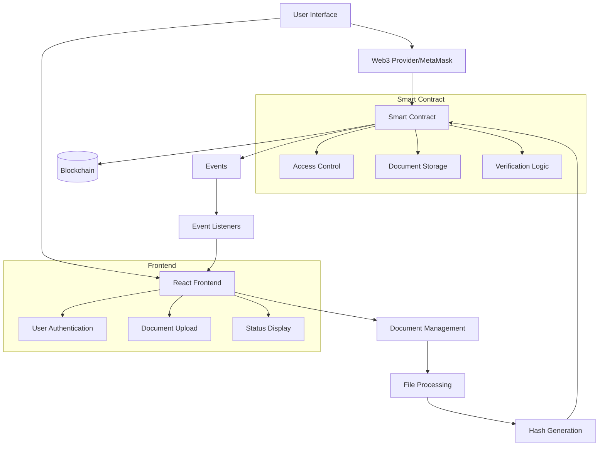

# System Architecture

## Component Description

1. **Smart Contract Layer**
   - Document registration and verification
   - Access control management
   - Event emission
   - Status tracking

2. **Frontend Layer**
   - User interface components
   - Web3 integration
   - File handling
   - Status updates

3. **Blockchain Layer**
   - Transaction processing
   - State management
   - Event logging
   - Data persistence

4. **Integration Layer**
   - MetaMask connection
   - Network management
   - Transaction handling
   - Event subscription